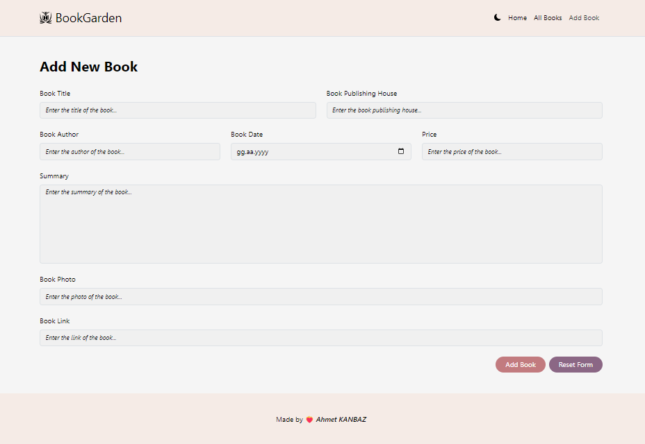
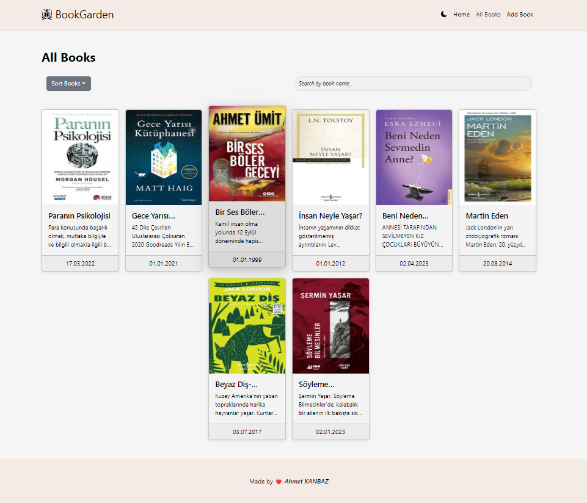
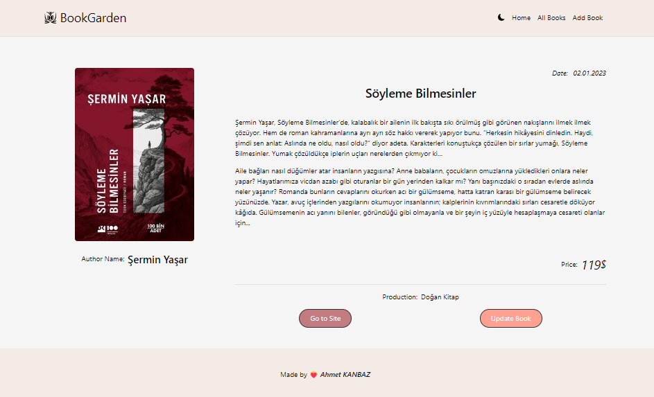
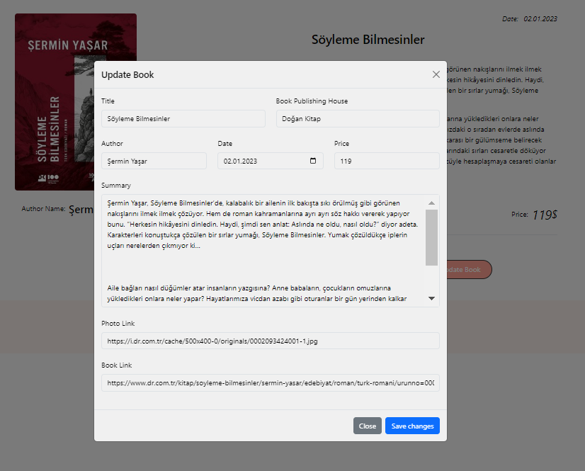

# BookGarden

Bu proje, React, JSON-Server ve diğer çeşitli kütüphaneleri kullanarak geliştirilen bir kitap yönetim uygulamasıdır.

## Özellikler

- **Kitap Ekleme**
- **Kitap Arama**
- **Kitap Sıralama**
- **Kitap Güncelleme**

## Kullanılan Teknolojiler
- **HTML**
- **CSS**
- **JavaScript**
- **React**
- **Bootstrap**
- **React Router**
- **React Hooks**
- **Redux**
- **Formik**
- **Yup**
- **Axios**
- **JSON-Server**
- **Styled Components**
- **React- Icons**

## Canlıya Alma
Bu proje, [Netlify](https://www.netlify.com/) üzerinde canlıya alınmıştır. Sitenin canlı hali [buradan](https://bookgarden.netlify.app/) görüntülenebilir.

## Ekran Görüntüleri
### Ana Sayfa Fotoğrafları

### Kitap Ekleme Sayfası

### Tüm Kitapların Görüntülendiği Sayfa

### Detay Sayfası

### Güncelleme Modalı

## Katkıda Bulunma

Eğer projeye katkıda bulunmak istiyorsanız, lütfen bir konu açın veya benimle iletişime geçin.

[BookGarden](https://bookgarden.netlify.app/)

[Ahmet KANBAZ](https://github.com/ahmetkanbaz)